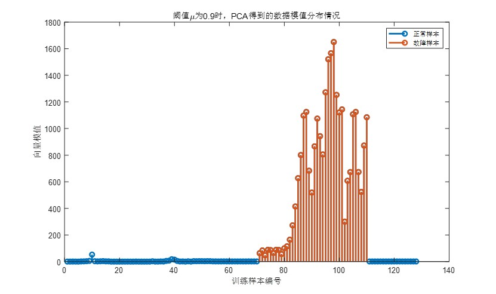
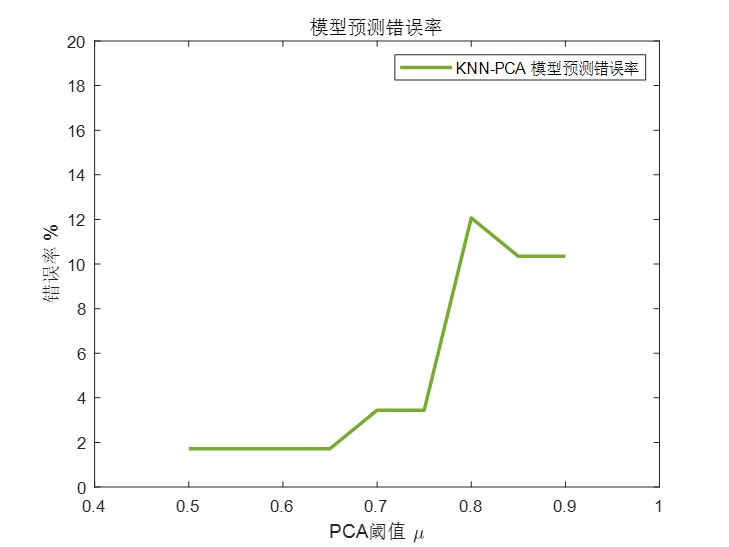

# PCA-KNN-Matlab  
PCA-KNN算法实现（Matlab）

---
# 文件分布：  
### train.m：训练PCA模型  
### test.m：测试PCA模型正确率，采用KNN算法  
### 其他：函数等  

---
## KNN算法原理：
KNN算法的思想就是计算样本与训练集中向量差的范数，找出范数最小的K个值，决定样本应该分类到哪里。KNN属于有监督算法。

## PCA原理及得到的训练样本分布：
PCA是一个简单的机器学习算法，属于无监督算法（即不需要人工辅助来提供“监督”），其本质与通信工程中的编码相同。即提取源数据的特征（这里我们利用矩阵的特征值与特征向量）
### 其中红色为异常样本

## PCA-KNN模型正确率
### 最优情况下为1.7241%左右

 
